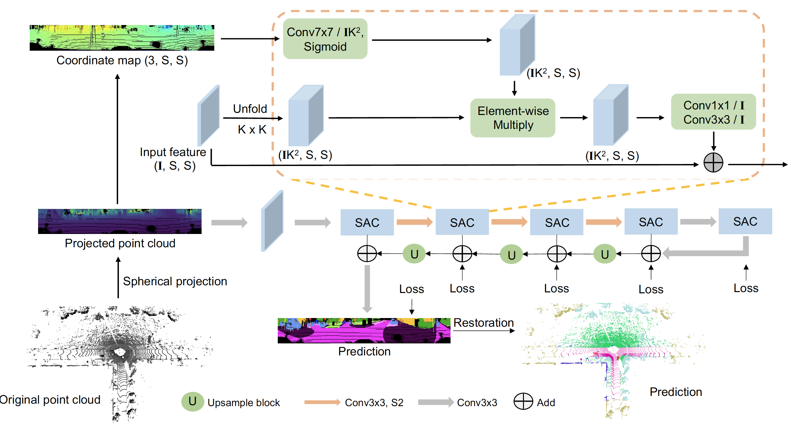
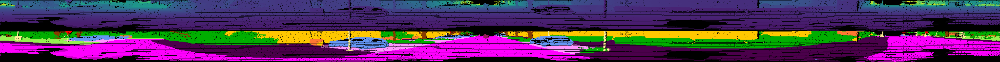

# SqueezeSegV3: Spatially-Adaptive Convolution for Efficient Point-Cloud Segmentation. (ECCV2020)
By Chenfeng Xu, Bichen Wu, Zining Wang, Wei Zhan, Peter Vajda, Kurt Keutzer, and Masayoshi Tomizuka.

This repository contains a Pytorch implementation of SqueezeSegV3, a state-of-the-art model for LiDAR segmentation. The framework of our SqueezeSegV3 can be found below:

<p align="center">
    
</p>


Selected quantitative results of different approaches on the SemanticKITTI dataset (* means KNN post-processing):

|   Method       | mIoU | car | bicycle| motorcycle | truck | person | bicyclist | motorcyclist | road |
| ---------------|------|-----|--------|------------|-------|--------|-----------|--------------|------|
| SqueezeSeg     | 29.5 |68.8 |16.0    |4.1         |3.3    |12.9    |13.1       |0.9           |85.4  |
|SqueezeSegV2    | 39.7 | 81.8|18.5    | 17.9       |13.4   |20.1    |25.1       |3.9           |88.6  |
| RangeNet21     | 47.4 |85.4 |26.2    |26.5        |18.6   |31.8    |33.6       |4.0           |91.4  |
| RangeNet53     | 49.9 |86.4 |24.5    |32.7        | 25.5  |36.2    |33.6       |4.7           |**91.8**|
|SqueezeSegV3-21 |48.8  |84.6 |31.5    |32.4        | 11.3  |39.4    |36.1       |**21.3**      | 90.8 |
|SqueezeSegV3-53 |52.9  |87.4 |35.2    |33.7        |29.0   | 41.8   |39.1       | 20.1         | **91.8**|
|SqueezeSegV3-21*|51.6  |89.4 |33.7    |34.9        |11.3   |42.6    |44.9       |21.2          |90.8|
|SqueezeSegV3-53*|**55.9**|**92.5**|**38.7**|**36.5**|**29.6**|**45.6**|**46.2** | 20.1         | 91.7 |

Visualization results of SqueezeSegV3:
<p align="center">
    
    
</p>


For more details, please refer to our paper: [SqueezeSegV3](https://arxiv.org/abs/2004.01803). The work is a follow-up work to [SqueezeSeg](https://github.com/BichenWuUCB/SqueezeSeg), [SqueezeSegV2](https://github.com/xuanyuzhou98/SqueezeSegV2) and [LATTE](https://github.com/bernwang/latte). If you find this work useful for your research, please consider citing:

```
@inproceedings{xu2020squeezesegv3,
  title={Squeezesegv3: Spatially-adaptive convolution for efficient point-cloud segmentation},
  author={Xu, Chenfeng and Wu, Bichen and Wang, Zining and Zhan, Wei and Vajda, Peter and Keutzer, Kurt and Tomizuka, Masayoshi},
  booktitle={European Conference on Computer Vision},
  pages={1--19},
  year={2020},
  organization={Springer}
}
```

Related works:

```
 @inproceedings{wu2018squeezesegv2,
   title={SqueezeSegV2: Improved Model Structure and Unsupervised Domain Adaptation
   for Road-Object Segmentation from a LiDAR Point Cloud},
   author={Wu, Bichen and Zhou, Xuanyu and Zhao, Sicheng and Yue, Xiangyu and Keutzer, Kurt},
   booktitle={ICRA},
   year={2019},
 }
 
@inproceedings{wu2017squeezeseg,
   title={Squeezeseg: Convolutional neural nets with recurrent crf for real-time road-object segmentation from 3d lidar point cloud},
   author={Wu, Bichen and Wan, Alvin and Yue, Xiangyu and Keutzer, Kurt},
   booktitle={ICRA}, 
   year={2018}
 }
 
@inproceedings{wang2019latte,
  title={LATTE: accelerating lidar point cloud annotation via sensor fusion, one-click annotation, and tracking},
  author={Wang, Bernie and Wu, Virginia and Wu, Bichen and Keutzer, Kurt},
  booktitle={2019 IEEE Intelligent Transportation Systems Conference (ITSC)},
  pages={265--272},
  year={2019},
  organization={IEEE}
}
```

## License
**SqueezeSegV3** is released under the BSD license (See [LICENSE](https://github.com/chenfengxu714/SqueezeSegV3/blob/master/LICENSE) for details).

## Installation

The instructions are tested on Ubuntu 16.04 with python 3.6 and Pytorch 1.1.0 with GPU support.

* Clone the SqueezeSeg3 repository:


```shell
git clone https://github.com/chenfengxu714/SqueezeSegV3.git
```

* Use pip to install required Python packages:


```shell
pip install -r requirements.txt
```
* The SemanticKITTI dataset can be download [here](http://semantic-kitti.org/dataset.html).


## Pre-trained Models

The pre-trained SqueezezSegV3-21 and SqueezeSegV3-53 are avaliable at [Google Drive](https://drive.google.com/drive/folders/1oIZXnMxQPaEINlI11V3kn_kXdSTfUgm6?usp=sharing), you can directly download the two files.


## Demo

We provide a demo script:
```shell
cd ./src/tasks/semantic/
python demo.py -m /path/to/model
```
You can find the prediction .label files and projected map in ./src/sample_output file, an example is shown below:
<p align="center">
    
</p>


## Inference
To infer the predictions for the entire dataset:

```shell
cd ./src/tasks/semantic/
python infer.py -d /path/to/dataset/ -l /path/for/predictions -m /path/to/model
```

To visualize the prediction for the sequence point cloud:
```shell
python visualize.py -d /path/to/dataset/ -p /path/to/predictions/ -s SQ_Number
```


## Training

```shell
cd ./src/tasks/semantic/
```

To train a network (from scratch):

```shell
python train.py -d /path/to/dataset -ac /config/arch/CHOICE.yaml -l /path/to/log
```


To train a network (from pretrained model):

```shell
python train.py -d /path/to/dataset -ac /config/arch/CHOICE.yaml -l /path/to/log -p /path/to/pretrained
```

We can monitor the training process using tensorboard.
```shell
tensorboard --logdir /file_path/
```

## Evaluation

```shell
python evaluate_iou.py -d /path/to/dataset -p /path/to/predictions/ --split valid
```


## Credits
We referred to RangeNet++ ([Paper](http://www.ipb.uni-bonn.de/wp-content/papercite-data/pdf/milioto2019iros.pdf), [Code](https://github.com/PRBonn/lidar-bonnetal)) during our development. We thank the authors of RangeNet++ for open-sourcing their code.


